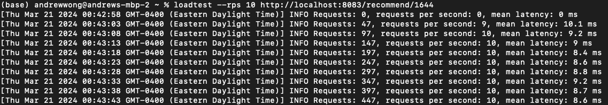

# Rate-limiter-proxy-by-redis
A proxy server for rate limiting, implemented by Redis and Golang

# Set-up
```shell
# 1. run a redis server (if you don't have one)
docker run --name movie-recomend-redis -d -p 6379:6379 redis redis-server --requirepass secretpassword
# 2 start the proxy server
# Note: the following parameters assume that the
# backend service `http://localhost:8082/recommend/userid` is running.
# And the parameters limit the backend can only process 10 requests per second.
go run main/start.go \
  -maxRequest=10 \
  -expireTime=1 \
  -rateLimitKey="MLiP-recommend-endpoint" \
  -redisAddr="localhost:6379" \
  -password="secretpassword" \
  -backendURL="http://localhost:8082" \
  -proxyPort=":8083" \
  -endpoint="/recommend/"
```

# Showcase
-  At 10 requests per second (RPS) to the `/recommend` endpoint, the service operates without errors.
and no error.

- At 11 RPS, the service begins to enforce rate limiting, resulting in some requests being denied to maintain the rate limit.


# Latency Introduced by the Proxy Server
- If the Redis server and proxy server run on the same machine, the proxy server adds approximately 2-4 ms of latency.
